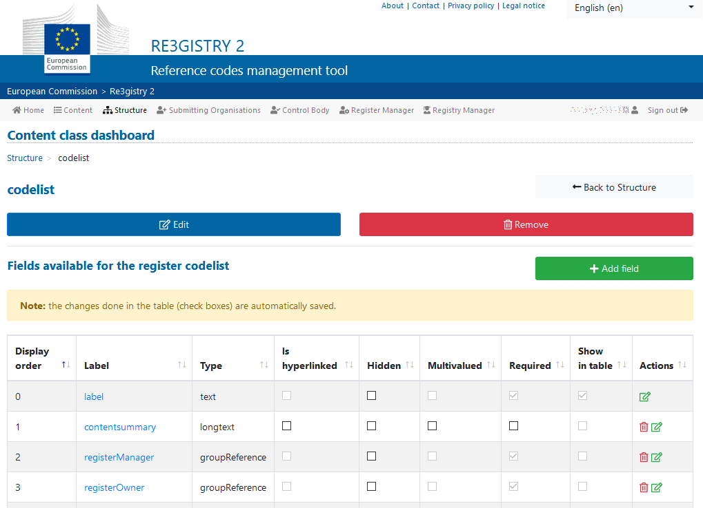
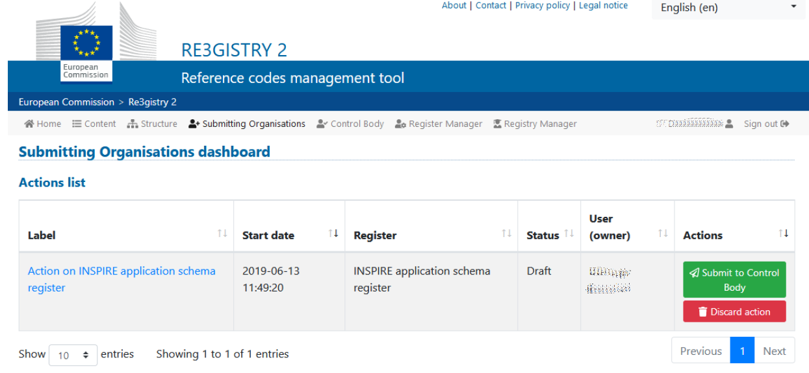
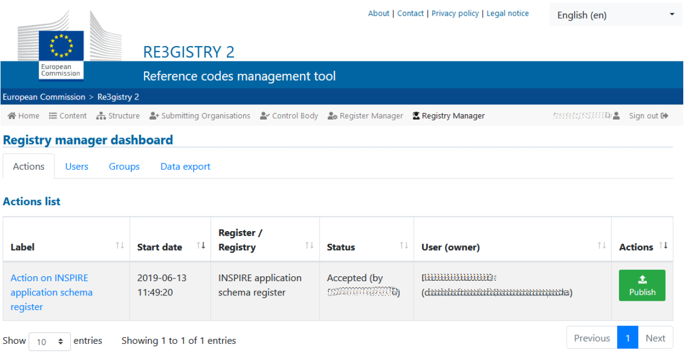

# Re3gistry 2 – Quick start guide

## Introduction
This document will guide the user through the basic functionalities of the Re3gistry 2 management interface.
Once the user has logged-in to the system, the menu bar contains the different operational areas (tabs) provided by the system:
- Content
- Structure
- Submitting Organizations
- Control Body
- Register Manager
- Registry Manager
 
The following sections will provide a brief overview of each of them.

## Content
The **content** area allows the user to **browse**, **edit** (existing item) and/or **create a new item** in the content of the Registry. Moreover, the user can perform additional actions like **supersede or invalidate** an item.

## Structure
The **structure** area allows the user to **manage** the underlying characteristics of all the registry, the registers and the items. Here each **content class** can be defined and/or edited **including its relative fields**.

## Submitting Organizations
This area is visible to the users having the **submitting organization** role. The submitting organization user can see all the **actions** performed alongside the **status** of the **requests**.
The **submitting organization** can submit change proposals to the **control body**, can react on eventual requests from the **control body** and discard the proposed changes.

## Control Body
This area is visible to the users having the **control body** role. The control body dashboard gives the possibility to **check** the change proposals submitted by the submitting organizations and to **approve**, **approve with changes** or **reject** those changes.

## Register Manager
This area is visible to the users having the **register manager** role. These users are allowed to **publish** the changes formerly approved by the **control body** so that they appear publicly in the registry service.

## Registry Manager
This area is visible to the users having the **registry manager** role. As for the register manager, the registry manager users are allowed to publish the changes formerly approved by the control body so that they appear publicly in the registry service.

Additionally, the registry manager can **edit the registry details** and manage important system functionalities with the **user management** and **group management** panel as well as the possibility to **run data export** (e.g. to Solr).

