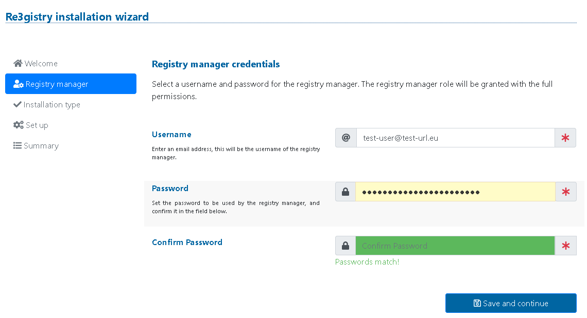
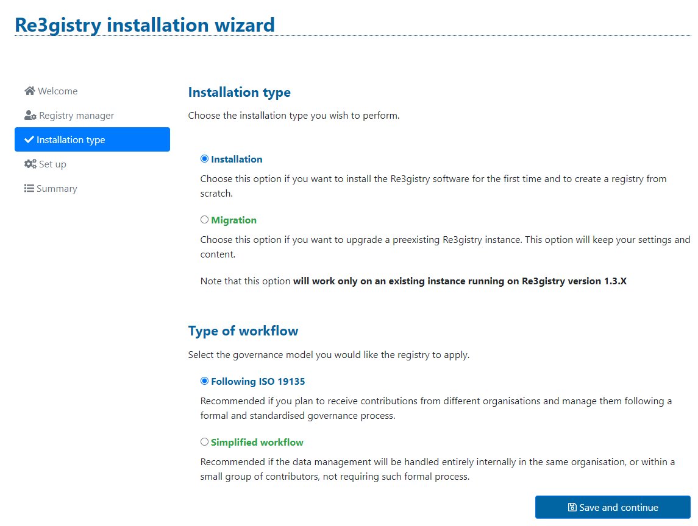
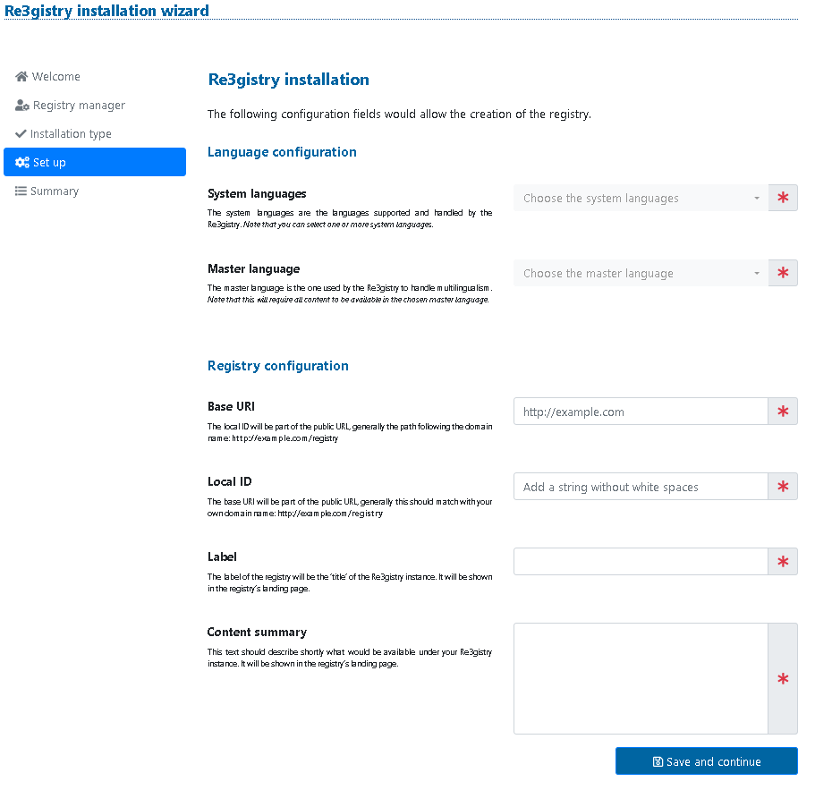
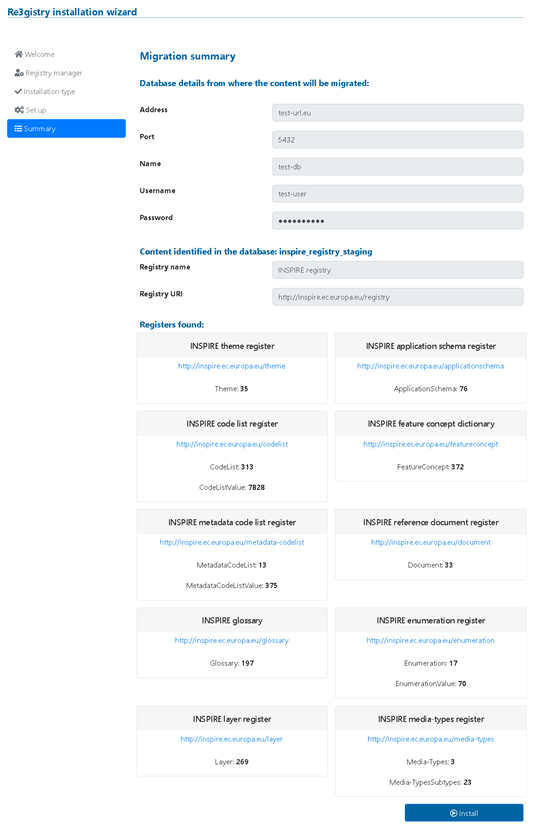

# Administrator manual

## Scope

This manual is aimed at users who will install and set up the Re3gistry software.
The following documentation provides details related to the installation and configuration of the Re3gistry 2 software. For more information on using the software, refer to the [User manual](user-manual.md).

This is a live document; it is being improved continuously. To have the last version, you can refer to https://github.com/ec-jrc/re3gistry.

Please report any feedback on the documentation [in the GitHub issue tracker](https://github.com/ec-jrc/re3gistry/issues).

## Overview
The Re3gistry is a reusable open-source solution for managing and sharing "reference codes".

This manual will cover the following topics:

* Installing and configuring the software
* Installing and configuring "registry service front-end web application

The requirements to run the software are:

* Machine with 4GB of RAM
* [Apache Httpd server](https://httpd.apache.org/) (or another Http server)
* Java 1.8 – versions higher than 1.8 should not be used, and the code should be compiled and run using Java 1.8[^note_java_8]
* [Apache Tomcat](https://tomcat.apache.org) 8.5 or 9.0[^note_apache_tomcat]
* [Apache Solr](https://solr.apache.org/) 8.x[^note_apache_solr]
* PostgreSQL 9.6 (the system supports other relational databases, but it has been tested only on the specified one - for the list of supported databases, please check [this link](https://wiki.eclipse.org/EclipseLink/FAQ/JPA).)

[^note_java_8]: This is because the software is dependent on the [https://en.wikipedia.org/wiki/Jakarta_XML_Binding](JAXB framework) (package `javax.xml.bind`, see also [JAXB on Java 9, 10, 11 and beyond](https://www.jesperdj.com/2018/09/30/jaxb-on-java-9-10-11-and-beyond/).
[^note_apache_solr]: Check the version of the jar file `solr-solrj-8.x.y.jar` of the Solrj Client API in the distribution (this version can be set when building the software with Maven, using property `${application.solr.version}`, and install the matching server.
[^note_apache_tomcat]: The software is dependent on classes from the `javax.servlet` package, and therefore Tomcat 10 cannot be used; see also [Migration Guide - Tomcat 10.0.x](https://tomcat.apache.org/migration-10.html). See [Apache Tomcat Versions](https://tomcat.apache.org/whichversion.html) for more information about the different Apache Tomcat Versions.

The prerequisites to follow this manual are:
* to have an instance of Apache Tomcat installed and configured to run with Java 1.8
* to have an instance of Apache Solr installed and configured
* to have a PostgreSQL database server installed and configured (or an alternative relational database server)

## Installing the Re3gistry software

The following steps need to be followed to install the system properly.

### Distribution package

The [distribution folder](../dist/) contains all the files required for the Re3gistry system installation. Download the distribution package and check the folder content. 

The "app" folder contains the Registry 2 main application and the related Re3gistry 2 rest API application.

The "webapp" folder contains an example web app that can be used to create the public service front-end.

The "customize-interface" folder contains a profile example for the admin to be used to customise the interface. After changing the paths in the script and after a first run, the GitHub project will become personalised with your own footer, header, and configurations.   

The "db-script" folder contains the database initialisation script.

All the folders contain files that need customisation for your environment. Therefore, the distribution package includes an automatic initialisation script that will prepare the files for installation.

In particular, the `init.properties` contains customisable properties (detailed below).

* dbhost: the address of the database to be used by the Re3gistry (e.g. 192.168.0.1)
* dbport: the port of the database (e.g. 5432)
* dbname: the name of the database (e.g. re3gistry2_db)
* dbuser: the user to access the database
* dbpassword: the password to access the database
* statusbaseuri: the status base URI is the first part of the URL of the status contained in the system. Usually, this URI is the same as the service's main URL. Still, since, in some cases, it may be different, the Re3gistry system is providing this option (e.g. https://test-uri.eu).
* solrurl: the URL of the Apache Solr instance to be used (e.g. http://localhost:8983/solr/). Note that you must create a new dedicated Solr core named "re3gistry2". If you need to change the name, you can edit it in the configuration.properties (application.solr.core property).
* smtphost: the address of the SMTP server (e.g. yoursmtp.test-url.eu)
* applicationrooturl: the root URL of the application (e.g. http://www.test-url.eu/re3gistry2)
* rsspath: the path on the filesystem for the RSS file containing the release-note.xml automatically generated by the system. If you want to expose the file on the web, this path should also be set up on your HTTP server.

The init script must be launched once the above file has been customised. Depending on your system, you must launch init-config.bat (Windows systems) or init-config.sh (Linux systems).

Note: the script is just customising the properties required for the system to run. The application's configuration files contain more customisation and configuration options. You can change those options by checking the following files. All the properties are well documented in the configuration file itself.

* app/re3gistry2/WEB-INF/classes/configurations_files/configuration.properties
* app/re3gistry2restapi/WEB-INF/classes/configurations_files/configuration.properties

### Database setup

The first step is to run the database initialisation script on the database created for the Re3gistry (if you do not have a database, create a new one).

Run the SQL script available in `dist/db-scripts/registry2_drop-and-create-and-init.sql`
(customized following the steps presented in the previous section).

### Installation of the Re3gistry 2 core app on Tomcat

Make sure the Tomcat instance is not running (stop it).

To install the application, copy the content of the `dist/app` folder (customized following the steps presented in the previous section) in the `<tomcat-home>/webapp` folder.
The Tomcat webapp folder should have the following two folders:

* `<tomcat-home>/webapp/re3gistry2.war`
* `<tomcat-home>/webapp/re3gistry2restapi.war`

*Important note*: the folder `<tomcat-home>/webapp/re3gistry2/WEB-INF/classes/*configurations_files*` and `<tomcat-home>/webapp/re3gistry2restapi/WEB-INF/classes/*configurations_files*` needs to have write permission (the installation file is going to be written there).

The last step is to start Tomcat.
You can run the customisation script from `/dist/customize-interface\example-profile-admin` to have the desired interface.

### Installation wizard

To start the installation wizard, visit the following address: `http://<tomcat-url>:<tomcat-port>/re3gistry2/install` (e.g. `http://localhost:8080/re3gistry2/install`). 
Note: do not visit `http://<tomcat-url>:<tomcat-port>/re3gistry2`, as the welcome page of the application is `http://localhost:8080/re3gistry2/login` (see sources/Re3gistry2/src/main/webapp/WEB-INF/web.xml). That page should only be visited after a successful installation.

The first page is just an introductory description. Click on "continue".

The "Registry manager" page lets you define the account for the system administration (Registry manager). Insert a valid e-mail and a password. Then click on "Save and continue".



The next step allows you to choose between 2 options:

*  Installation: choose this option to install the Re3gistry software for the first time and to create a registry from scratch
* Migration: choose this option if you want to upgrade a preexisting Re3gistry instance. This option will keep your settings and content. Note that this option **will work only on an existing instance running on Re3gistry version 1.3.X**.



The installation process also allows you to choose the application workflow to use.

* ISO 19135: Recommended if you plan to receive contributions from different organisations and manage them following a formal and standardised governance process.
* Simplified: Recommended if the data management will be handled entirely internally in the same organisation or within a small group of contributors, not requiring such a formal process.

#### Installation option

If the "Installation" option is chosen, the basic configuration for the new registry will be requested.

* System languages:  are the languages supported and handled by Re3gistry. Note that you can select one or more system languages.
* Master language: the master language is used by the Re3gistry  to handle multilingualism. Note that this will require all content to be available in the chosen master language.
* Base URI: the base URI will be part of the public URL generally this should match your own domain name: **http://example.com**/registry
* Local ID: the local ID will be part of the public URL, generally the path following the domain name: http://example.com/**registry**
* Label: The registry label will be the ‘title’ of the Re3gistry 2 instance and be shown on the registry’s landing page.
* Content summary: this text should describe shortly what would be available under your Re3gistry 2 instance. It will be shown on the registry’s landing page.

After filling in all the information, click "Save and continue".



The next step will present a summary of the information inserted. If all the fields are correct, click "Install" to begin the installation.

Once the installation is finished, the user is redirected to the login page.

#### Migration option

If the "Migration" option is chosen, the database details from the existing Re3gistry installation are requested.

Fill in the requested fields and click the "Save and continue" button. You will then get a page containing a summary of the data retrieved in the existing instance of the Re3gistry.



Click on "Install" to begin the migration. An information page will be shown. Now, you can close the browser. The system will notify you via e-mail using the address specified in the "Registry manager" definition step.

#### RSS release note

To set up the RSS release note automatic generation, you need to copy the example "release-note.xml" file (available in dist/app/re3gistry2/WEB-INF/classes) to the RSS path defined in the init.properties file (at the beginning of the installation). 

## Installing the example service frontend

The Re3gistry webapp consumes the Re3gistry 2 Rest API to create an HTML version of the service. This webapp can be used to publish the services using a web interface. 
The guide below explains how to install the webapp.

### Important information

The example webapp is provided without any cookie notice script. It has to be implemented by the final user.

### Installation steps

#### Copy required files
The first step to install the webapp is to copy the files contained in the folder [public_html](dist/webapp/) in the document root designated to host this webapp (e.g. in  /var/www/registry-example.eu/public_html). 

#### Configuring the webapp

Once the files have been copied, the configuration files need to be customised. The configuration files can be found at [webapp-root]/conf/conf.js.

Every configuration entry is well documented with inline comments. An important customisation part is where all the required URLs are specified ("The app's base URLs").

#### Configuring the HTTP server

The webapp also contains an example configuration file for the Apache HTTP server. 
This file may need some customization based on your OS and Apache version.

The Apache configuration file (apache-example-configuration.conf) can be found in the [webapp](../dist/webapp/) folder.

Remember to restart the Apache HTTP server after including the configuration.

## Additional notes

### Open API descriptor

The OpenAPI 3 descriptor is available in the [source](../sources/Re3gistry2RestAPI) folder: "openapi.yaml".
This file can be exposed through an HTTP server to describe the Re3gistry 2 API in a machine-readable way. 

### Building the service API cache

The software has an engine that automatically creates the cache for all the elements. To start this engine, you must launch the following command from the server console (the example below assumes that your servlet container is configured on port 8080).
```
curl --noproxy localhost -i -X GET http://localhost:8080/re3gistry2restapi/cacheall
```

### Swagger OpenAPI interactive UI

To access the swagger openapi interactive interface, you will have to change the parameters
found in the [docker-compose](https://github.com/ec-jrc/re3gistry/blob/develop/sources/Re3gistry2-build-helper/docker-compose.yml) file. The default value and ports for the UI are
localhost:8082.

The frontend and backend interfaces have an "Access API" hyperlink on the footer element. These links point to the default swagger URL; you might have to change it afterwards.

You can manually add, edit and remove some of the options of the open API interface by editing
the existing [openapi.json](https://github.com/ec-jrc/re3gistry/blob/develop/sources/Re3gistry2-build-helper/swagger/openapi.json) file.

### Changing error messages

You can change how the error messages are shown in your Re3gistry local instance.
The default error messages are changed in the conf.js file in the 
[Re3gistry2ServiceWebapp/public_html/conf/conf.js](https://github.com/ec-jrc/re3gistry/blob/master/sources/Re3gistry2ServiceWebapp/public_html/conf/conf.js). 
Two parameters in this file change the error messages: the definition changes the text of reference to appear in the text shown, and the URL is the referenced link accessible by clicking that text.

Modifying these messages to reference your helpdesk or contact emails is highly recommended.

### Email notifications and templates

You can change some of the variables of the different email templates, such as the instance/organisation name. 

To change those, you can access the[configuration.properties](https://github.com/ec-jrc/re3gistry/blob/master/sources/Re3gistry2/src/main/resources/configurations_files/configuration.properties) file, where you can search the mail template variables by searching the "mail.text" variables.
You can see the different subjects and text that you can change. Consider that some of these may need some proper code changing in their respective java classes.
App's default name is Re3gistry2; this variable is used in email templates showing the instance name. The property that manages this name is called "application.default.name". This variable can be found in the same [configuration.properties](https://github.com/ec-jrc/re3gistry/blob/master/sources/Re3gistry2/src/main/resources/configurations_files/configuration.properties) file.

Please ensure that you configure an email server to handle notifications and ensure proper delivery of emails.
