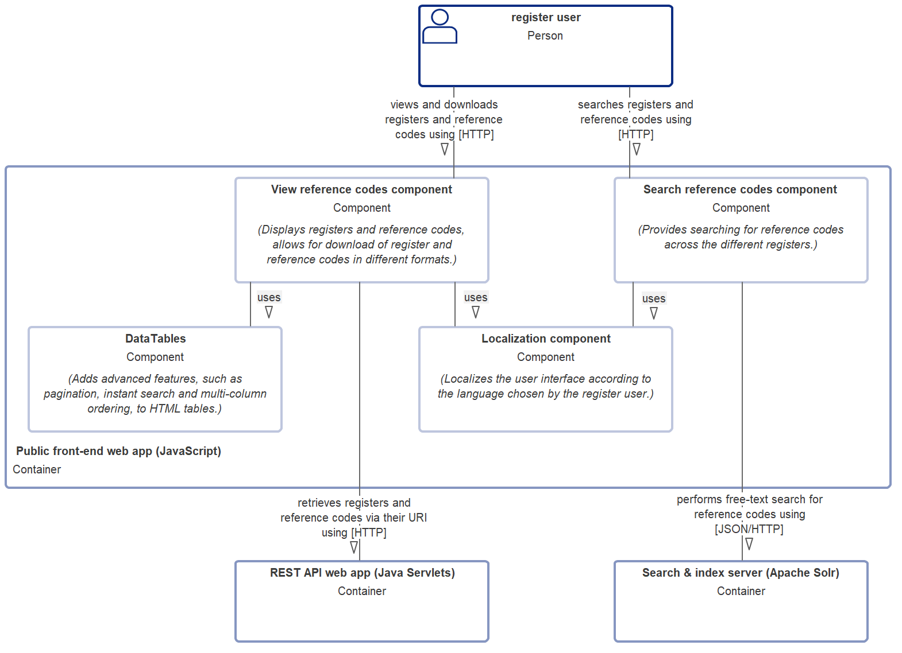
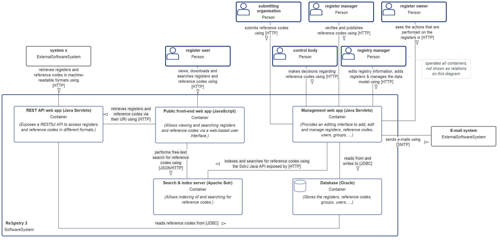
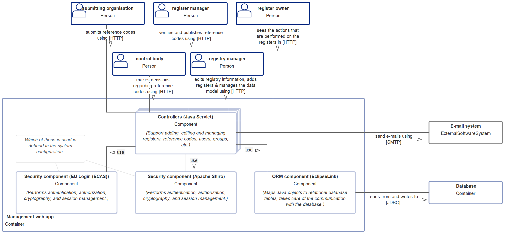
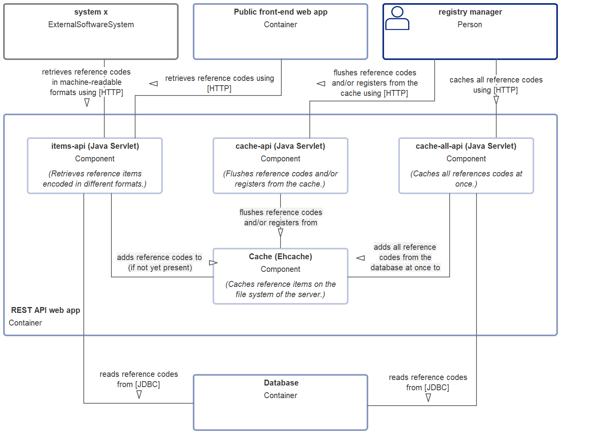
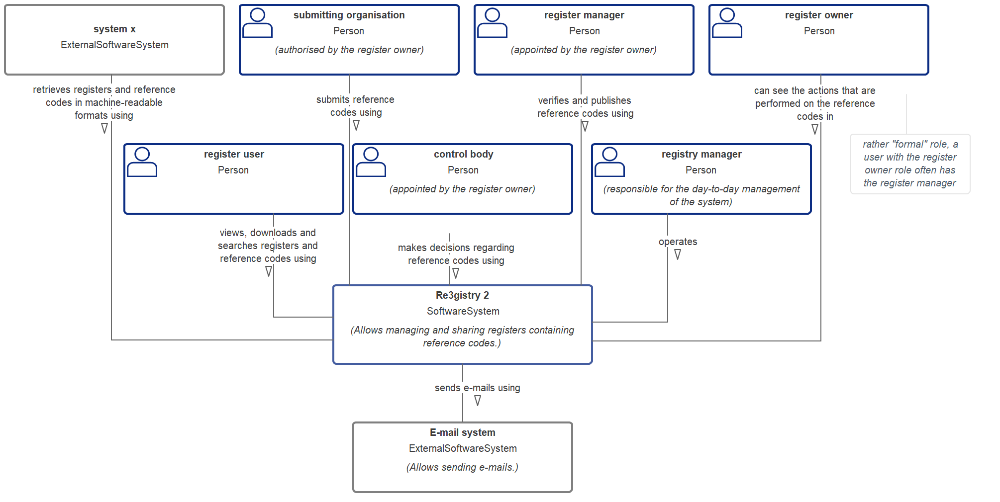

# Developer manual

## Scope

This manual is intended for programmers wishing to customize or extend the Re3gistry 2 software. Programmers wishing to extend or customize the Re3gistry 2 software are expected to know and understand Java as well as object oriented design principles. The understanding of HTML, JS and rest services is also required.

If you want to have more information on how to use or install the software, refer to the [User manual](user-manual.md) or to the [Administrator manual](administrator-manual.md).

The following documentation provides information related to the module included in the Re3gistry 2 software and their functionalities. The details of the classes and files that are included in each module are not available in this guide, since the source code is well commented directly "in line".

This is a live document; it is being improved continuously. To have the last version you can refer to https://github.com/ec-jrc/re3gistry.

Please report any feedback on the documentation [in the GitHub issue tracker](https://github.com/ec-jrc/re3gistry/issues).

## Overview

The Re3gistry 2 has been developed in a modular way. This means that the software is divided in modules that are providing a specific functionalities. The modules are described in the following sections.

A summary of some of the technologies used to implement the software is presented below.

* Programming language: Java (1.8)
* Middle-ware: EclipseLink (tested with PostgreSQL)
* Authentication: Apache Shiro / EU Login
* Front-end languages and components:
  * HTML 5
  * jQuery 3.x
  * Bootstrap 4.x

### Initialization of the project

There is one library (ecas-tomcat-client) in the sources that is not available in any public maven repositories. For that reason, it is included in the Re3gistry2Base module in the "dependencies" folder.
To initialize the local maven repository, the first step to do is to launch the maven "initialize" goal on the Re3gistry2Base project (&lt;package-root&gt;/sources/Re3gistry2Base).

## Software modules

The following sections are providing a description of each module and its functionalities. The details of each class can be found directly inline in the code.

### Re3gistry2 Base

This module contains all the common utility to be used in the application. Examples of "utility" are: Mailing system, String functionalities, etc.

The Java sources contained in this module are subdivided in 3 different packages:

* eu.europa.ec.re3gistry2.base.utility: containing all the common utilities, such as the string functions, string input sanitizers, authentication helper, configuration helper, ecc.
* eu.europa.ec.re3gistry2.base.utility.exceptions: this package contains some custom exceptions implemented for example for the authentication system.
* eu.europa.ec.re3gistry2.base.utility.localization: this package contains the object and the managers that are handling the localization system.

### Re3gistry2 Model

This module contains the data model as Java Object. The database model is reflected in the Java Object model using Eclipse-link (JPA).

The Java sources contained in this module are subdivided in 3 different packages:

* eu.europa.ec.re3gistry2.model: this package contains all the Java objects that represent the Database model.
* eu.europa.ec.re3gistry2.model.utility: this package contains the utilities that are managing for example the creation of the UUID and the model.
* eu.europa.ec.re3gistry2.model.uuidhandlers: this package contains all the classes that are managing the creation of the uuid related to each specific object of the model.

### Re3gistry2 CRUD interface

The interfaces has been introduced to give the possibility to extend the application to many persistence layer. It defines all the methods that a driver for a specific persistence layer has to implement. An example could be to have an implementation for the Relational Databases, another for SPARQL, etc.

The Java sources contained in this module are subdivided in 1 package:

* eu.europa.ec.re3gistry2.crudinterface: all the interface for the classes needed to access the persistence layer are available in this package.

### Re3gistry2 CRUD RDB

This module is the driver for the Relational Database persistence layer . It is implementing all the methods required by the related interface.

The Java sources contained in this module are subdivided in 2 different packages:

* eu.europa.ec.re3gistry2.crudimplementation: here all the managers are implementing the interfaces, providing the access to the persistence system.
* eu.europa.ec.re3gistry2.crudimplementation.constants: this package contains the constants used by the above mentioned classes

### Re3gistry2 Java API

The Java API modules is handling the write logic and operations (create, update, delete) to the system, using the driver implemented (in this case the Re3gistry CRUD rdb).

The Java sources contained in this module are subdivided in 3 different packages:

* eu.europa.ec.re3gistry2.javaapi.handler: this package contains the classes that are providing the Java APIs for most of the action available on the system.
* eu.europa.ec.re3gistry2.javaapi.handler.action: this package contains the classes that are handling automatic actions, like the bulk import.
* eu.europa.ec.re3gistry2.javaapi.solr: the handler of the actions to store the data in the Solr engine are available in this package.

### Re3gistry2 Migration

The migration module takes the data from the old data model and migrate them to the new model. At the installation of the system the user is asked to choose between having a clean system installation or to import all the data that are available from an older version of the software.

The Java sources contained in this module are subdivided in 4 different packages:

* eu.europa.ec.re3gistry2.migration.handler: this package contains some utility that are managing the steps of the installation and migration system.
* eu.europa.ec.re3gistry2.migration.manager: this package contains the manager that are performing the actions needed to migrate the data from the old database model to the new one.
* eu.europa.ec.re3gistry2.migration.migrationmodel: this package contains the model related to the database of the old version of the Re3gistry software.
* eu.europa.ec.re3gistry2.migration.utility: this package contains the utility that are used by the migration system, like the constants, the tools to calculate the statistics of the items to be migrated, etc.

### Re3gistry2 REST API

This module provides APIs to access the data of the registry in different formats and languages.

This is a web application that expose the RESTful APIs to the web.
The Java sources contained in this module are subdivided in 4 different packages:

* eu.europa.ec.re3gistry2.restapi: this package contains the core of the API system
* eu.europa.ec.re3gistry2.restapi.cache: this package is handling the cache for the API
* eu.europa.ec.re3gistry2.restapi.format: this package is containing the java classes that are providing a specific data format. If there is the need of a new format,a new class that is handling the required format should be created here.
* eu.europa.ec.re3gistry2.restapi.util: this package is containing the different utilities used by the API system.

### Re3gistry2 Service Web-app

This is the web-app to provide the service front-end. The web-app is developed in HTML 5, using Boostrap 4.x as UI library.

All the JSPs, representing the "view" layer, have their respective "control layer" in the source packages.

The web services for the UI, used directly in the web pages by Ajax calls, are available in the "jsp/ajaxServices" folder. This JSP are exposing the json encoding; the data are provided by the related controller in the sources section.

The JavaScript configuration are read from the application's configuration files, and exposed through a dynamic JS provided by a JSP contained in the folder "jsp/dynamicJs".

Some common files, reused in different JSPs, such as the Header and the footer, are collected in the "jsp/includes" folder.

* eu.europa.ec.re3gistry2.web.controller: this package contains all the controlled related to the JSP available in the web application.
* eu.europa.ec.re3gistry2.web.utility.jsp: this package contains the utilities that are used in the JSP pages such as common HTML pieces calculated based on some parameters, or some checks done at JSP level.

### Re3gistry2 build helper

The Re3gistry2-build-helper module is an helper for the build operation (it allows to launch the build operation just on one place instead building each module one by one).
In the pom.xml of this module, you can find 2 example profile, one for local development and one for server deployment. 

**Notes**
Some of these modules are depending ones by others. You can check all the structures and dependencies having a look at the pom.xml file.

### Architecture

The follows diagrams will help you to see the general architecture of this application.

Frontend architecture:

Full application workflow

Managament

RestAPI

Roles

### How to customize GitHub to use your own files

Please check the folder "dist\customize-interface\example-profile-developer". Here you will find a script to be run after the customization of your own paths to your local repository of the project and you own customize files: such as footer, header, configurations. Once the script has copied all the files into your own repository you can start using the system already containing your own customize interface.

### Configuration Apache SHIRO
The Apache SHIRO configuration is defined in `source\Re3gistry2\src\main\resources\shiro.ini` and `sources\Re3gistry2\src\main\webapp\WEB-INF\web.xml`.

Add to your profile 

     <application.login.provider>SHIRO</application.login.provider>

Restart the service and check the authentication menchanism.

### Configuration EU Login
EU Login is the central login mechanism of the European Commission. You can enable login against that central service in case your intended users have or can acquire a EU Login.

The EU Login configuration is defined in
`sources\Re3gistry2\src\main\resources\ecas-config.properties` and `sources\Re3gistry2\src\main\webapp\WEB-INF\web.xml`.

Add to your profile 

     <application.login.provider>ECAS</application.login.provider>
     <ecas.filter.serverName>CHANGE_ME_SERVER_NAME</ecas.filter.serverName>
     <ecas.filter.serverPort>CHANGE_ME_PORT</ecas.filter.serverPort>
     <ecas.filter.serverContextPath>CHANGE_ME_CONTEXT_APPLICATION</ecas.filter.serverContextPath>

For tomcat, add two files to the tomcat lib folder: ecas-tomcat-x.y.z.jar and log4j-x.y.z.jar. 

Verify that the JDK trusts the [ECAS certificates](https://webgate.ec.europa.eu/CITnet/confluence/display/IAM/Downloads-Certificates) else import them on the keystore of the JVM.

Restart the service and check the authentication menchanism.
