# User manual

## Scope

This manual is intended for users that are using an instance of the Re3gistry 2 software to manage and publish reference codes.

The following documentation focuses on how to make use of the Re3gistry 2 software. For information on how to install or configure the software, refer to the [Administrator documentation](administrator-manual.md).

This is a live document; it is under continuous improvement. To get the last version please visit https://github.com/ec-jrc/re3gistry.

Please report any issue or feedback related to the documentation in the dedicated [GitHub issue tracker](https://github.com/ec-jrc/re3gistry/issues).

## Overview

### What is the Re3gistry 2

The Re3gistry 2 is a reusable open source solution for managing and sharing "reference codes".

It provides a consistent central access point where labels and descriptions for reference codes can be easily browsed by humans and retrieved by machines.

Reference codes are exchanged between applications to uniquely reference some ‘thing’. They can be used to define sets of permissible values for a data field or to provide a reference or context for the data being exchanged. Examples are enumerations, controlled vocabularies, taxonomies, thesauri or, simply, ‘lists of things’.

The Re3gistry 2 supports organisations in managing and updating reference codes in a consistent way. 

### Features and capabilities

* User friendly editing interface to add, edit and manage easily the registers and reference codes
* Management of the full lifecycle of the reference codes (based on the ISO 19135 Standard)
* Highly flexible and customisable data models
* Multi-lingual content support
* Support for versioning
* RESTful API with content negotiation (including OpenAPI 3 descriptor)
* Free-text search
* Supported formats: HTML, ISO 19135 XML, JSON, RDF/XML, ATOM, Re3gistry XML, CSV, ROR
* Service formats can be easily added or customised
* Multiple authentication options
* Externally governed items referenced through URI 
* INSPIRE register federation format support (option to automatically create the RoR format)
* Web-app to access the reference codes in a human readable way.

### License

The Re3gistry 2 is released under the [European Union Public License - EUPL v.1.2](../LICENSE).

### Acknowledgments

The development of this tool has been funded by the European Interoperability Programme ISA2 though the [ELISE action](https://joinup.ec.europa.eu/collection/elise-european-location-interoperability-solutions-e-government/elise-re3gistry-software). The European Location Interoperability Solutions for e-Government (ELISE) Action aims at Enabling Digital Government through Geospatial Data and Location Intelligence.

This new version of the software has been developed in cooperation with the [National Land Survey of Finland](https://www.maanmittauslaitos.fi/en). 

## Introduction to the Re3gistry 2

The Re3gistry 2 editing interface allows managing graphically the complete life-cycle of reference codes, such as the code lists, enumerations controlled vocabularies, taxonomies, thesauri or, simply, 'list of things'.

The actions available to the user are reflected in the menu structure. 

Depending on the type of user account, the user may see different tabs in the menu.

The common tabs available to any users are:
* Home: page showing an overview of the last actions performed
* Content: page allowing  interacting and operating with the content

Details for each menu item are provided in the following sections.

## Simplified workflow

If the simplified workflow has been chosen during the installation, the only role that will be use is the Registry Manager. This workflow will simplify the steps mentioned in the following sections. There will be no need to process the data through all the different roles, all the actions will appear in the Registry manager tab directly.

## Users, roles and groups

The Re3gistry 2 follows the [ISO 19135 Standard "Geographic information — Procedures for item registration"](https://www.iso.org/standard/54721.html).

The possible user roles that the registry 2 manages are:

* Registry manager
* Register owner
* Register manager
* Control body 
* Submitting organisations

The system is highly flexible in managing the **roles** since it is not assigning the role directly to the **user**. Instead, the user is assigned to one or more **groups**. Then this group is associated to one or more **registers**, specifying the role for each of the group. This means that a group can have different roles on different registers. Each user in the system can be associated to one or more groups. 

An example on roles and groups assignment is provided in the following box.

---

**Groups**

* Organisation A
* Organisation B
* Organisation C
* Organisation D
* Organisation E

**Registers**

* Vegetables
* Fruits
* Animals

**Mapping**

| Register | Register owner | Register manager | Control body | Submitting organisation |
|---|---|---|---|---|
| Vegetables | Organisation A | Organisation A  | Organisation B | Organisation D |
| Fruits | Organisation E | Organisation A  | Organisation C | Organisation B, Organisation D |
| Animals | Organisation C | Organisation D  | Organisation E | Organisation A |

---

### Registry manager

It is an organisation or a person responsible for the day-to-day management of the registry.

The registry manager has the highest privileges in the system. 
This role can perform three different tasks:

*  make any action on the reference codes. The changes done to the reference codes need to undergo the approval workflow by obtaining the approval from the **control body**.

* manage the structural elements of the system. He can change and edit information related to the registry and the registers, add new registers, manage the fields of the registry, registers, reference codes. These structural changes do not need to have the approval workflow.
* manage both users and groups.

### Register owner

It is an organisation establishing its own register.

In the Re3gistry 2 software, the register owner can access the reference code management system to see the actions that are performed on the registers. 

It is rather a "formal" role, often controlled by users granted as well with the register manager role.

### Register manager

It is a person or an organisation delegated by the register owner to manage a register.

In the Re3gistry 2 software, the register manager can use the interface to verify and publish the changes once approved by the **control body**.

### Control body

It is a technical expert or group of them making decisions on the content of a register. At least one user with the control body role shall be available in the system to approve the changes to apply on the reference codes.

The control body can use the interface provided by the Re3gistry 2 software to:

* check the changes proposed by the **submitting organisations** and
* to decide on how to proceed through the following available actions: approve, reject or approve with change request.

### Submitting organization

It is an organisation authorised by the **register owner** to propose changes on the content of a register.

In the Re3gistry 2 software, the submitting organisations can use the editing interface:

* to propose changes to existing reference codes
* to propose the addition of new codes
* to change the status of the reference codes.

The submitting organisations can only propose change at the reference codes level. Only the **registry manager**, as overall administrator can act at the registry and register level.

Any action performed by a submitting organisation requires the review and approval by the control body to be applied.

## Status of a reference code

A reference code can pass through different status. The type of status may depend on:

* the approval management workflow or on
* the life-cycle of the reference code itself.

The workflow and possible status types related to the management of change proposals are available below.

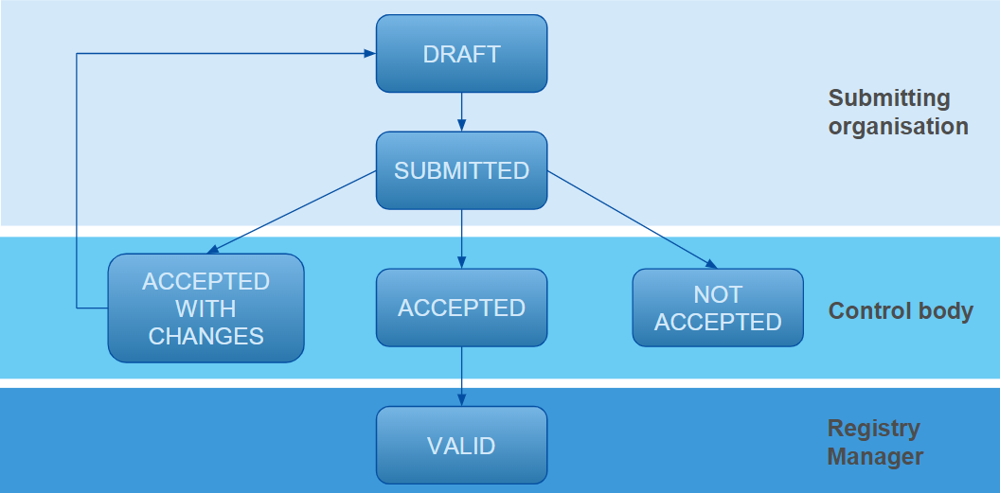

The workflow and possible status types related to the reference code itself once it becomes "valid" are available below.

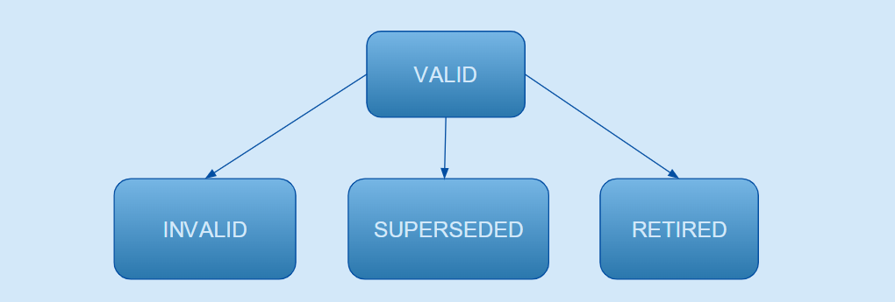

Detailed information on each of the possible status is available in the next paragraphs.

### Draft

A reference code is in "draft" status when a **change** is proposed by a **submitting organisation** but has not yet been submitted to the **control body**.

Items in draft status can only be edited by the user who started the change proposal.

### Submitted

A reference code is in "submitted" status when the user edits and submits the proposed changes  to the **control body** for approval.

Items with "submitted" status cannot be edited any-more.

### Accepted

A reference code enters in the "accepted" status once the **control body** accepts the changes formerly submitted by the **submitting organisation(s)**.

### Not accepted

If the **control body** decides that the proposed changes are not acceptable, the status of reference code becomes **"not accepted"**. If this is the case, the reference code lifecycle finalises and therefore it cannot be edited any more.

### Valid
After the acceptance of the control body, the status of reference code becomes “valid”.  The reference code is recommended for use.

### Invalid
If the control body considers that there is a substantial error on a "valid" reference code a previously valid reference code contains a substantial error it can decide to turn it to "invalid". Generally, an "invalid" reference code is replaced by a new "valid" reference code.

### Superseded
The reference code has been superseded by a new or a different "valid" reference code and therefore its use is no longer recommended.

### Retired
When a reference code no longer recommended for use and there are no supersession envisages, the status can be changed to "retired".

## Functionalities

This section provides detailed information on the functionalities available in the Re3gistry 2 user interface illustrated by screenshots.

### Content editing and browsing section

The content tab is the main part of the system. It allows both browsing and editing any registers and reference codes contained in the system.

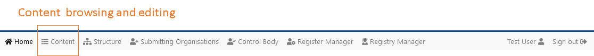

The **browsing feature** is available for all the user roles while the editing feature is only  available for "submitting organisations" and "registry manager".

Check next which are the available editing functionalities by user role.

#### Submitting organizations

To be able to edit and manage the reference codes contained in a register, the user shall be associated with a **group** set as **"submitting organisation"** for that specific register.

In the next image are shown on the left the list of **roles** and on the right, the **group** assigned to each role for that specific register, in the example being "INSPIRE code list register". The group with the "Submitting organisation" role in this case is "Example submitting organisation". 

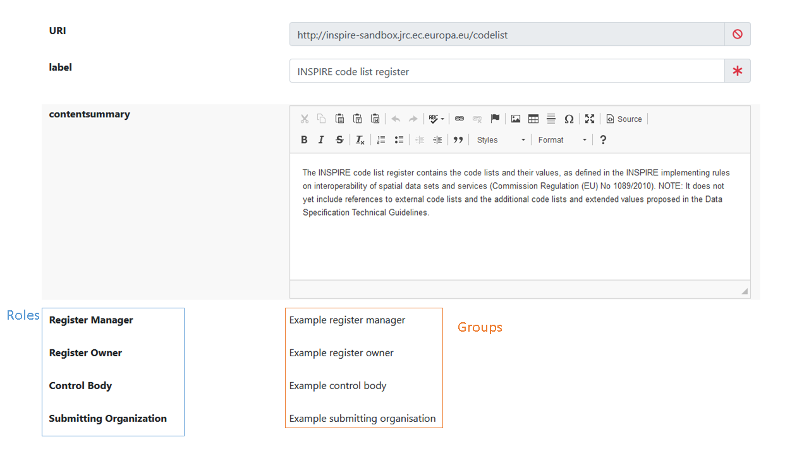

The actions available for the "submitting organisation" role are listed below.

##### Edit/change the existing reference codes 

The change of an existing reference code is done directly using the **input box** available in the interface. After performing a change, the interface switches to a **two columns layout** to better highlight the changes: on the left column appear the proposed changes while on the right column are shown the original values. The differences between both versions are also underlined by the use of a yellow background.

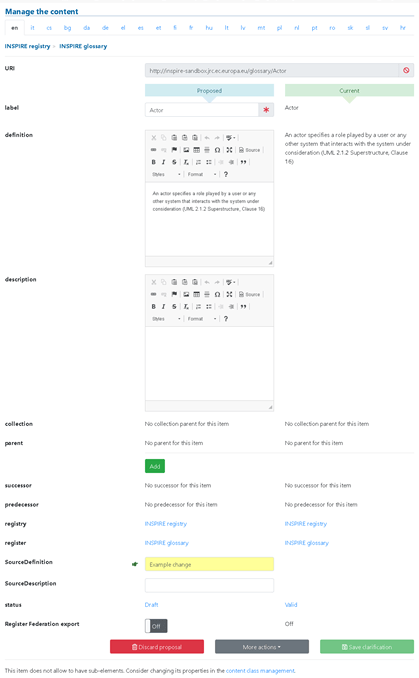

##### Register federation export

The editing interface provides also a flag to allow the system to expose the reference code in the RoR format. In this way it can eventually be imported in the [INSPIRE register federation](https://inspire-regadmin.jrc.ec.europa.eu/ror/).

##### Add new reference codes

To propose the addition of a new reference code in a specific register, click on the button "Add item" available in the interface. A page containing the predefined structure of the siblings' reference codes will show up with the empty fields to be completed.

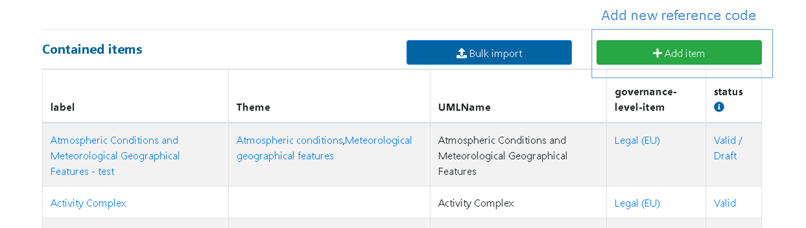

##### Change the status of a reference code

The dropdown menu "More actions", at the bottom of the page allow to propose the change of status of a reference code. The possible options are three:
    
* **Invalidate** a reference code, specifying the successor
* **Supersede** a reference code, specifying the successor
* **Retire** a reference code.

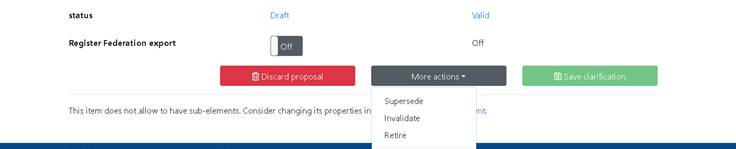

#### Registry manager

The users having the "registry manager" role can use this interface to edit the **Registry** information as well as to add **new registers**.

##### Edit registry information

The registry related information can uniquely be modified by a user with the registry manager role. **These changes do not need to undergo the change proposal workflow**.

##### Add a new register

To add a new register click on the button "Add register". A new page will appear asking to complete the information fields of the new register. A first list of standard fields will be associated to the recently created register. To add additional fields or to customise the pre-existing ones, please check the **structure** related information, explained later in this manual.

The addition of a new register within the registry can uniquely be done by a user with the registry manager role. These changes do not need to undergo the change proposal workflow.

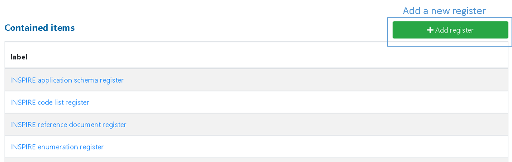

### Structure and data model management

The **structure** tab gives the user access to the management of the data model for each **entity** in the registry system by graphically adding and managing the fields and their properties.

This section is accessible only to the **registry manager**.

The main page of the structure tab contains the list of **content classes** available in the system.

A content class is automatically created every time that a new register is created or added in the **content** tab.

The content classes help shaping the "data model" of the entities available in the system. For instance, they help define each of the **fields** that will be available for a reference code; the same mechanism is used to define the fields related to a register or even the registry itself. 

By managing the content classes details it is possible to:
* set the order of the fields to be displayed in the user interface,
* select which fields should be visible or hidden and
* manage other properties related to that field.

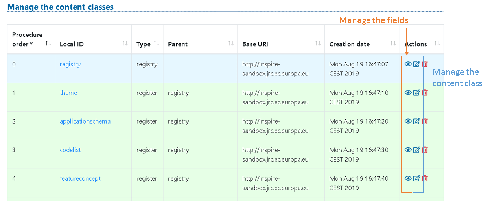

When clicking on the name of the content class or on the "eye" icon, the **fields' management** page is opened showing the list of associated fields to the selected **content class**.

Check next the actions available for the field management pages.

The **field management** page shows all the fields that are currently available for the selected content class. 

#### Ordering a field

The first column of the table, "Display order", is responsible for managing the order where to place a field. The user can easily reorder each field by using the drag and drop feature. 

The order set here will be reflected both in the editing interface and in the public web application.

#### Fields label

The label of the field can easily be modified. Additionally, it can be translated to any of the languages available in the system.

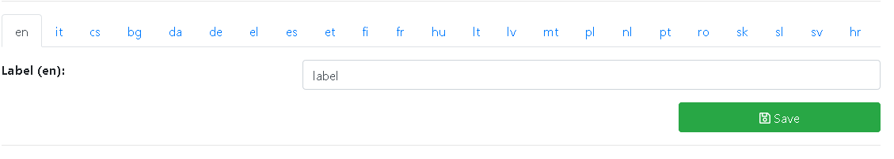

#### Properties of the fields

The fields' table allows to customise different properties for each field.

##### Is hyperlinked

By checking this box, the system will know that the field has to be hyperlinked. If checked, two fields will be requested to be completed: the label and the URL.

This property is only available for the fields of type **text** or **long text** (except the label that cannot have links).

##### Hidden

This property, if checked, hides the field in the public interface. This property is useful if information related to a reference code (or a register/registry) needs to be stored but kept private.

Note that even when active, the field keeps being displayed in the editing interface.

##### Multivalued

When checked, this property allows having more than one value for the same field.

##### Required

This property defines if the field shall be mandatory or not. When checked, the related fields shall be completed.

##### Show in table

This property allows defining if the field shall be visible in the overview table containing the collection of reference codes.

This property is not available for registers and the registry.

#### Adding a new field

For each **content class**, there is the possibility to define additional fields. The interface for adding new fields allows choosing between two options: **use an already defined field** or **create a new one**.

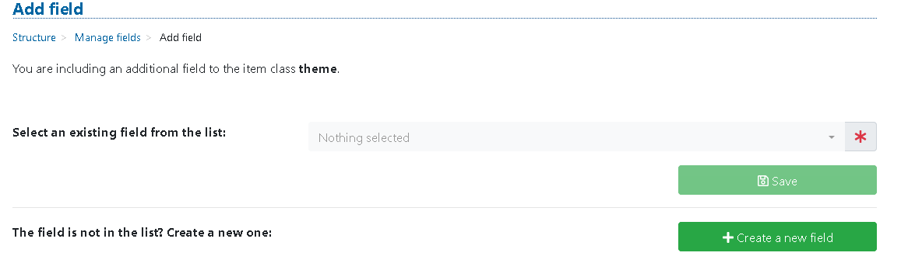

##### Use an existing field

All the fields created in the system for a specific entity (reference code, register, registry) can be reused by other entities. For example, if a "description" field is created for register x, it can be then reused for register y without the need of creating a new one from scratch.

To this purpose, in the "Add field" page the user can select any of the fields available from a list of and reuse it in the selected **content class**.

If the field is not available in the list, the user can still create using the next option "**Create a new field**".

##### Create a new field

To create a new field, the system will ask to fill some required information:

* The first one is a **unique identifier** for that field, the **Local ID**
* The label of the field in the master language is requested.
* The type from a dropdown list.

The types of the fields are explained below.

##### Text

A simple text with a maximum of 1024 characters.

##### Long text

A long text, in case the length of text to be inserted is greater than 1024 characters.

##### Date

The date field will display a date picker in the editing interface a.

##### Number

The number value will allow only numeric values.

##### Relation reference

This is a particular field type that allows defining relations between entities contained in the system. By using this type of field, the user can link a reference code in a register x that points another reference code from a register y.

When the relation reference type is selected, the system will ask to match the content class of the entity that needs to be pointed.

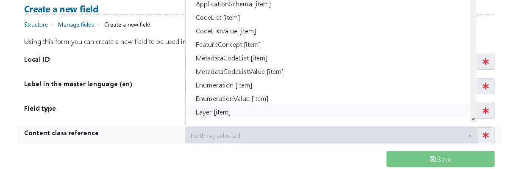

##### Date creation and Date edit 

These two content types are automatically calculated by the system to determine the date of creation or date of update.

These fields provide metadata information on the reference code management that often are useful to be shown in the public interface

### Submitting organisation tab

The submitting organisation tan contains the details of the actions done by the users belonging to the submitting organisation role.

The actions of proposed changes are grouped by register.

A submitting organisation user can discard the proposal unless this has already been submitted to the control body. If the "**discard**" button is clicked, a confirmation will be asked to the user.

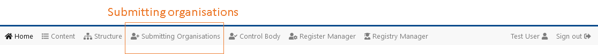

The actions available on this page are the submission of the proposed changes to the **control body** for the approval or to discard all changes done.

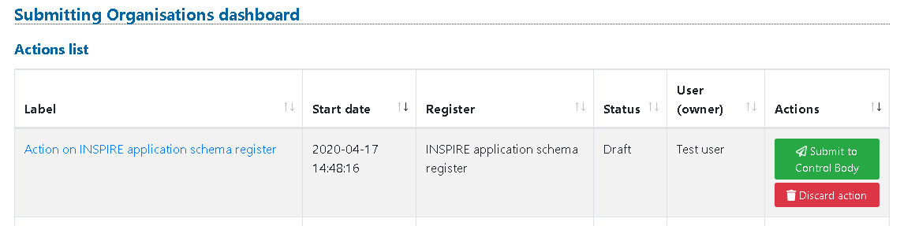

By entering in the details of one specific listed action, the user can also discard changes at the item level.

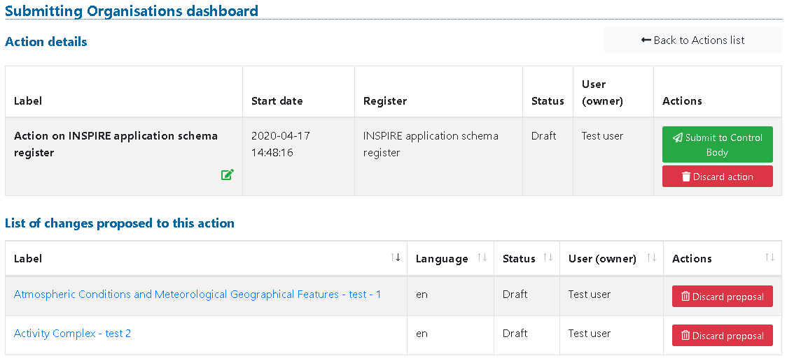

When a user decides to submit the action, a dialog window to insert optional details such as:. 

* A **change log** that can eventually be visible in the public front-end
* A **link** to an issue related to this change tracked in an **issue tracker**

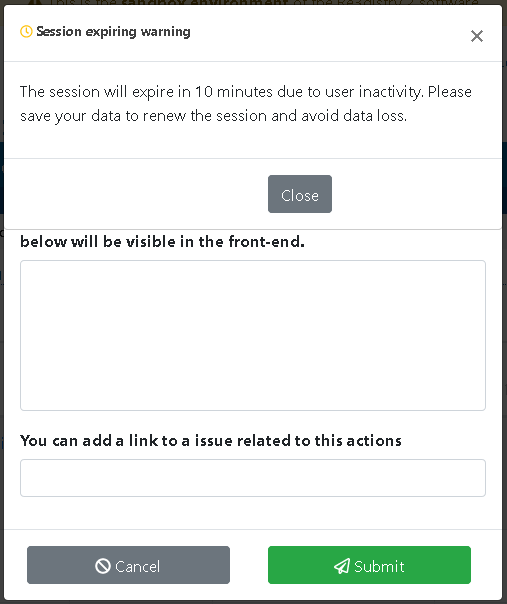

Once an action has been submitted to the **control body** the changes cannot be edited any more.

### Control body tab

The control body tab contains the details of all the action done in the relevant registers.

To see the actions, the current user shall be part of a group that has been assigned to the register with the role control body. 

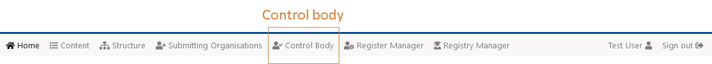

As for the submitting organisations, these actions are grouped by register. This means that if there are changes in 2 different registers, these changes will be grouped in 2 different actions. 

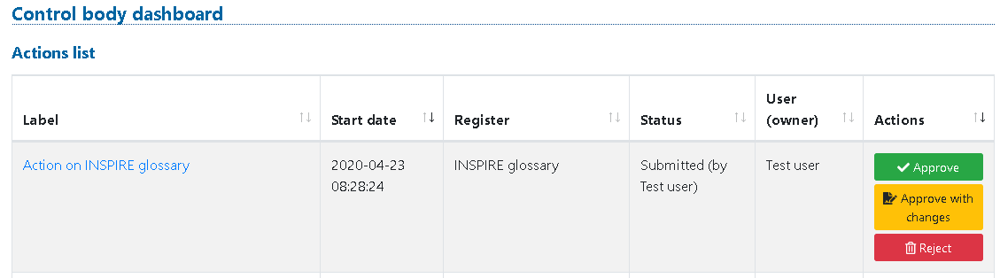

The available options are 3 and are listed below.

#### Accept

With this action the **control body** accepts all the changes contained in that action. After the approval, the next step is the publication of the changes by either the **register manager** or **registry manager**. 

#### Accept with changes

In this case, the **control body** needs too have some changes done before accepting the proposal. 

In this case, the control body has to provide a description of the requested changes in a dialog that will appear after pressing the "**Accept with changes**" button.

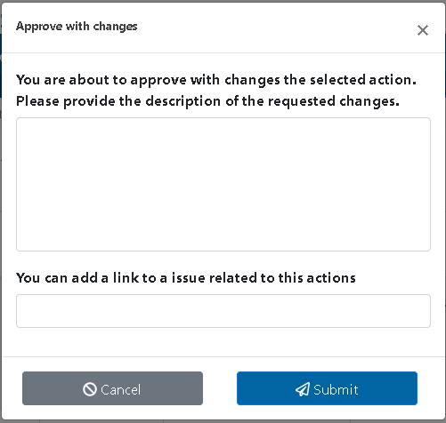

Once an action has been **accepted with changes**, it returns back to the draft status so that the **submitting organisation** can read and implement the requested changes. After performing the requested modification, the submitting organisation needs to submit again the changes to the control body for a new review.

In case the submitting organisation does not want to implement the changes, there is the possibility do discard all the changes proposed.

#### Reject changes

The **control body** can reject the proposals received by a submitting organisation if deemed so; in this case, a justification should be written in the prompted window.

### Register manager tab

The register manager tab contains the details of all the list of action proposed, grouped by registers.

To see these actions, the user shall be part of a group that has been assigned to the register with the role register manager.

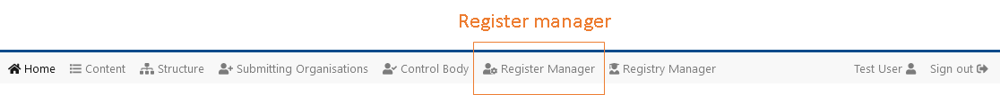

The single available option is the publication of the changes previously accepted by the control body. 

The publication action triggers the change of status of each of the reference codes involved in the changes passing from “**accepted**” to “**valid**“ and make the changes publicly visible (e.g. public website, APIs).

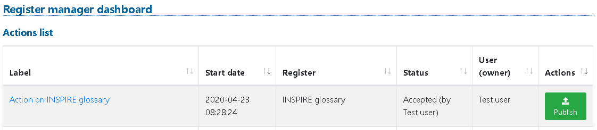

### Registry manager

As the **register manager**, the **registry manager** can publish the changes accepted by the **control body**.

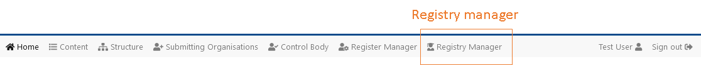

However, the registry manager can additionally:

* manage users and groups and
* manage the data export functionality.

See more details on these actions next.

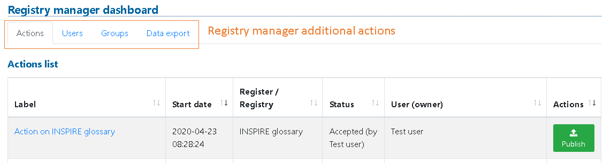

### Users

The user sub-tab presents a view of all the users that are active in the system. 
The registry manager can edit the information related to each user, including their mapping with **groups** and add new users.

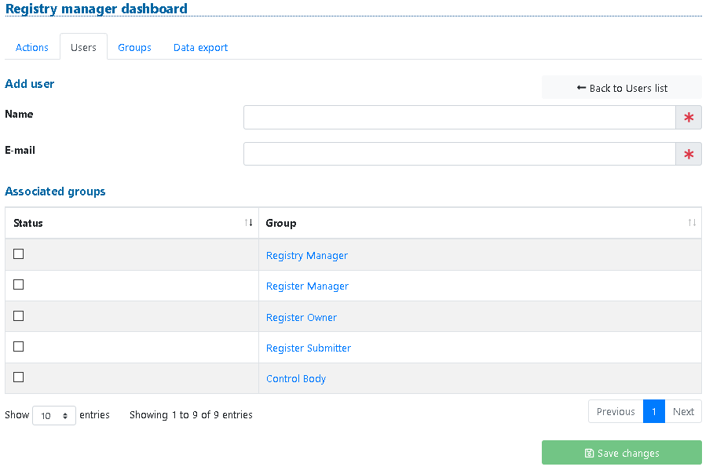

The user can be "**disabled** but not deleted. All the users are kept to have a traceable history of the registered items. However, if a user is deactivated he will not be able to log in to the system.

### Groups

The group sub-tab presents an overview of all the groups that are active in the system. The registry manager can edit the information related to each group. The registry manager can also add new groups.

In the group detail page apart from editing, group-related information can be checked the list of belonging to that group.

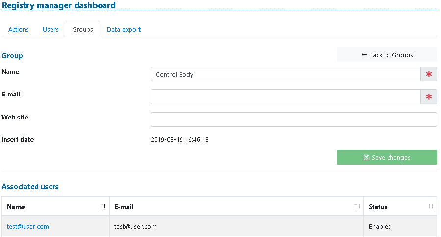

### Data export

The Data export sub-tab give the registry manager the possibility to run an complete SOLR index and a complete CACHE of the items presented in the system.

SOLR: This option helps to easily run a full export of the registry data to the Solr index on the published items.

CACHE: 
* Button "Cache all - Master language": This option helps to run a full cache of the master language of the system.
* Button "Cache all": This option helps to run a full cache of the active languages of the system.
* Button "Remove cache": This option helps to remove the index of all the cache items.

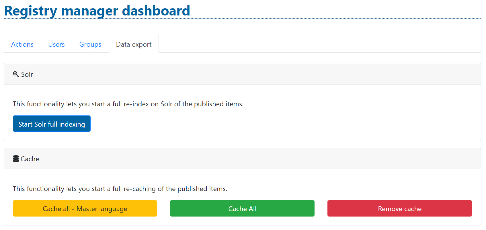

## User profile

The user can manage his details in the profile page. To access this section, the button is at the right side of the menu with the name of the user logged in.

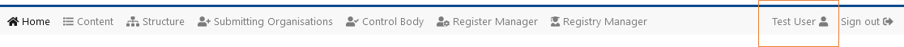

Depending on the type of installation, using an external authentication provider or the default one, the user could be able to update the name displayed in the system and change the password.

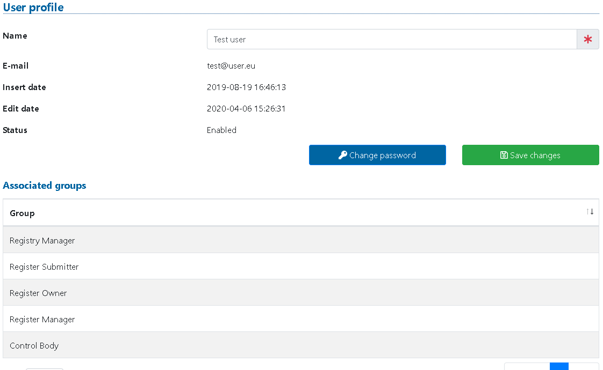

