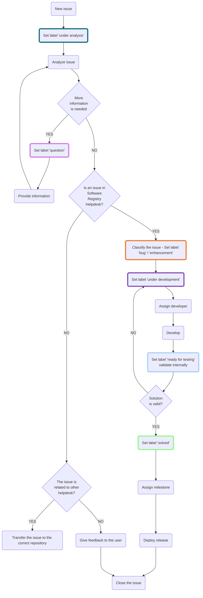

# Helpdesk-registry / helpdesk management

## Introduction

The establishment of proper communication with the Re3gistry community is a key asset for the operation, maintenance and update of the Re3gistry software. The [helpdesk of the Re3gistry](https://github.com/ec-jrc/re3gistry/issues) is the core of the communication strategy since it is the platform where users can report bugs, propose new features and start discussions on the Re3gistry software. The objective of this document is to illustrate the systematic workflow adopted by the Re3gistry team to organize, address and manage the issues reported by users in the Re3gistry helpdesk.

## Helpdesk management workflow

The helpdesk management workflow defines the actions performed by the Re3gistry team to address and solve the problems reported by the users of the Re3gistry software. The workflow makes use of a number of GitHub artefacts: labels, milestones, status and the project boards.

A set of [issue forms](<https://github.com/ec-jrc/re3gistry/tree/master/.github/ISSUE_TEMPLATE>) has been created to help the user to select the appropriate type of template for its issue. These forms will help the user to properly fill the issue with all the information required. A label or an assignation to a specific user will be also applied automatically depending on the configuration of each form.

### GitHub labels

To be able to know the status of each issue reported in the helpdesk (from the initial assessment to the final implementation of a solution for it), a number of labels are used. These are listed on [this page](https://github.com/ec-jrc/re3gistry/issues/labels) and are described in more detail below in the chronological order in which they are used while managing each Re3gistry issue:

- **_question_**: In case the issue requires further information from the user, the Re3gistry Team asks the user to provide it in the issue.
- **_under analysis_**: This label is assigned after the issue has been opened, and indicates that the Re3gistry Team is performing a first analysis to figure out what is the problem and how to address it; in case this requires further information from the user, the Re3gistry Team asks the user to provide it in the issue discussion.
- **_bug_**: This label is assigned when something isn’t working. The main purpose of this label is to obtain info about the typology of the issues and include this in reports.
- **_enhancement_**: This label is assigned when is a new feature or request. As well as bug label, the purpose of this label is to extract information for reports.
- **_under development_**: in case the initial analysis reveals that a change in the Re3gistry software is needed, this label is assigned to the issue to indicate that the Re3gistry team is developing a solution for the problem reported.
- **_ready for testing_**: The solution is ready to test.
- **_solved_**: After the issue is internally tested and confirmed that it works, this label is assigned.

The diagram below shows the full helpdesk management cycle for each issue, from the initial stage when it is opened to the final stage when it is closed.  Also includes and identifies the actions of the Re3gistry team.

# GitHub milestones

To inform users in advance about when the solution to each issue will be included in the release of the Re3gistry software, each issue is assigned to a specific milestone. Milestones are listed on [this page](https://github.com/ec-jrc/re3gistry/milestones). The release schedule of the Re3gistry software, which lists the expected release dates for each specific version, is available [here](https://github.com/ec-jrc/re3gistry/tree/management-draft/release-strategy). Once a new version of the Re3gistry software is released, the corresponding milestone is closed and moved to the list of closed milestones.

Schedule of next Major and Minor releases of the Re3gistry software. Plan for 2022-2024:

- Minor release: June 2022 (v2.3.3 6/2022)
- Major release: September 2022 (v2.4.0 09/2022)
  - Minor release: December 2022 (v2.4.1 12/2022)
  - Minor release: March 2023 (v2.4.2 3/2023)
  - Minor release: June 2023 (v2.4.3 6/2023)
- Major release: September 2023 (v2.5.0 09/2023)
  - Minor release: December 2023 (v2.5.1 12/2023)
  - Minor release: March 2024 (v2.5.2 3/2024)
  - Minor release: June 2024 (v2.5.3 6/2024)
- Major release: September 2024 (v2.6.0 09/2024)
  - Minor release: December 2024 (v2.6.1 12/2024)

Schedule of next Major and Minor releases of the Register Federation Tool (RTF). Plan for 2022-2024:

- Major release: November 2022 (0.1.0)
  - Minor release: February 2022 (0.1.1)
  - Minor release: May 2023 (0.1.2)
  - Minor release: August 2023 (0.1.3)
- Major release: November 2023 (0.2.0)
  - Minor release: February 2024 (0.2.1)
  - Minor release: May 2024 (0.2.2)
  - Minor release: August 2024 0.2.3)
- Major release: November 2024 (0.3.0)
