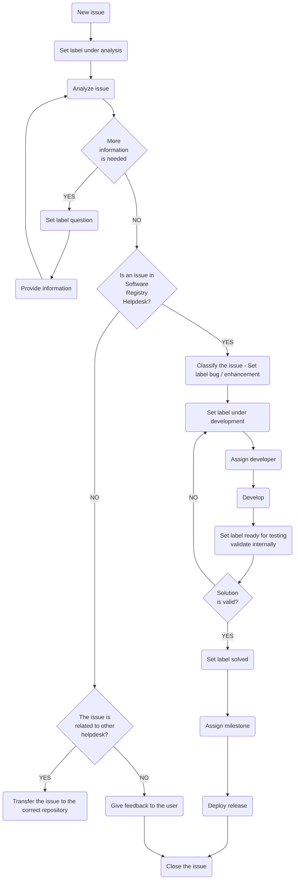

# Helpdesk-registry / helpdesk management

## Introduction

The establishment of proper communication with the Re3gistry community is a key asset for the operation, maintenance and update of the Re3gistry software. The helpdesk of the Re3gistry is the core of the communication strategy since it is the platform where users can report bugs, propose new features and start discussions on the Re3gistry software. The objective of this document is to illustrate the systematic workflow adopted by the Re3gistry team to organize, address and manage the issues reported by users in the Re3gistry helpdesk.

## Helpdesk management workflow

The helpdesk management workflow defines the actions performed by the Re3gistry team to address and solve the problems reported by the users of the Re3gistry software. The workflow makes use of a number of GitHub artefacts: labels, milestones, status and the project boards.

### GitHub labels

To be able to know the status of each issue reported in the helpdesk (from the initial assessment to the final implementation of a solution for it), a number of labels are used. These are listed on this page (link a la página de labels) and are described in more detail below in the chronological order in which they are used while managing each 

Validator issue:

- under analysis: this label is assigned after the issue has been opened, and indicates that the Re3gistry Team is performing a first analysis to figure out what is the problem and how to address it; in case this requires further information from the user, the Re3gistry Team asks the user to provide it in the issue discussion.
question: In case the issue requires further information from the user, the INSPIRE Registry Team asks the user to provide it in the issue.
- bug: This label is assigned when something isn’t working. The main purpose of this label is to obtain info about the typology of the issues and include this in reports.
- enhancement: This label is assigned when is a new feature or request. As well as bug label, the purpose of this label is to extract information for reports.
- under development: in case the initial analysis reveals that a change in the Re3gistry software is needed, this label is assigned to the issue to indicate that the Re3gistry team is developing a solution for the problem reported.
- ready for testing: [TODO]
- solved: If the change proposal does not need the Control body approval, the INSPIRE Registry Team will proceed to implement the proposal and will label the issue as solved (aqui hasta que la issue este solventada no deberiamos poner otro status para que el usuario sepa que estamos trabajando en ello?)
- Requires change in TG: Finally, when the change, approved by the Control body, affects the technical guideline, the issue will be labelled in order to be taken into account in the technical-guidelines helpdesk.
The diagram below shows the full helpdesk management cycle for each issue, from the initial stage when it is opened to the final stage when it is closed.  Also includes and identifies the actions of the INSPIRE Registry team.

# GitHub milestones

To inform users in advance about when the solution to each issue will be included in the Production instance of the INSPIRE Registry, each issue is assigned to a specific milestone. Milestones are listed on this page (link a la página de milestones) and their names have a 1:1 correspondence with the release versions of the INSPIRE Reference Validator. The release schedule of the INSPIRE Reference Validator, which lists the expected release dates for each specific version, is available here (link a la página de release strategy). Once a new version of the INSPIRE Registry is released, the corresponding milestone is closed and moved to the list of closed milestones (link a la página de milestones cerrados).
