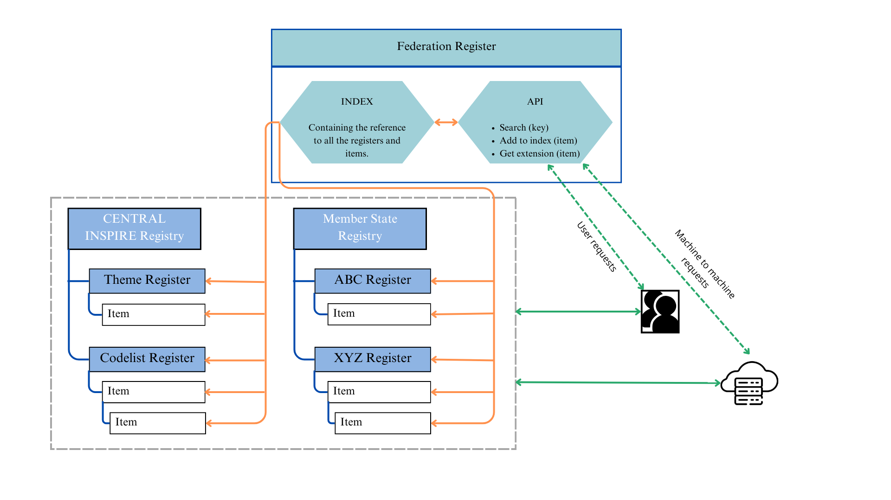

# Register Federation Tool

The **Register Federation Tool**, also known as "Register of Registers (RoR)", is an online platform providing a central access point to bring together or federate code lists or semantic asset registers. 

&copy; 2020-2024 European Union. Licensed under the EUPL.

## Features:

- Intuitive harvesting control panel
- Data access via interface and REST API
- Configurable authentication system
- Search in federated registry contents
- Relationship tab
- Implements ROR specification for the representation of code list extensions

## Background:
The European Commission Joint Research Center developed the Register Federation Tool as a testbed funded by the ISA Action 1.17 "ARE3NA" to test the feasibility of creating and declaring code list extensions that accommodate specific semantic needs while guaranteeing interoperability of the systems that use them. 

Since then, the European Commission operated the INSPIRE register federation, until October 2024. This tool was a distributed federation of registers related to the INSPIRE Directive operated by the European Commission. Where Member States needed to extend INSPIRE agreed on code lists, they could make the extended values available in local registers. 

> **Register Federation Tool** can be used in any domain that uses semantic assets, so it is freely distributed as an open source for anyone who needs to cover this gap.

## Register federation tool architecture

[

## RoR descriptor file
The idea of the descriptors is to provide metadata and data about the registries and registers to be included in the federation [More information about the descriptor file](https://github.com/ec-jrc/re3gistry/blob/master/sources/Registry-Federation-Tool/documentation/RoR%20descriptor%20file.md)
